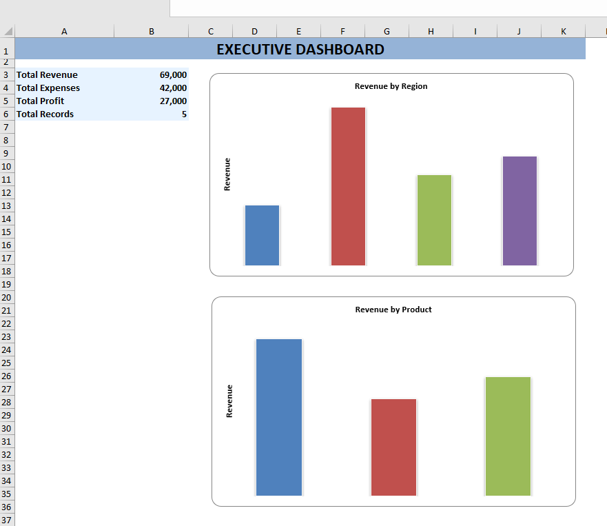
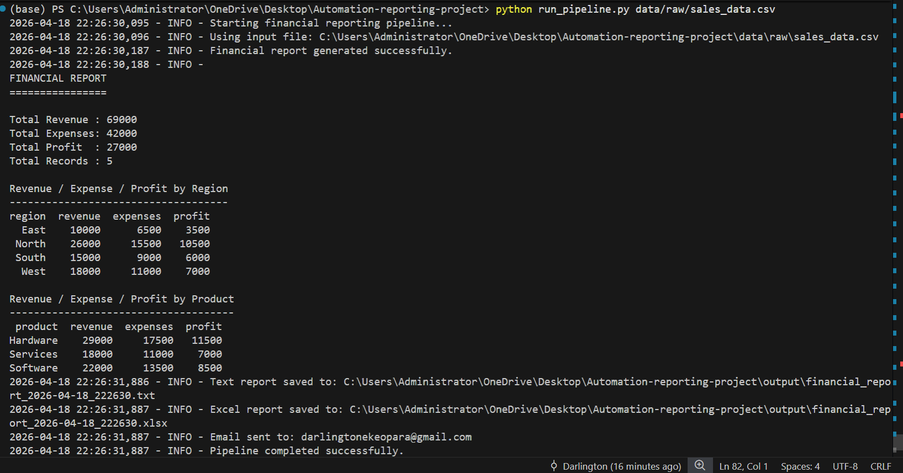
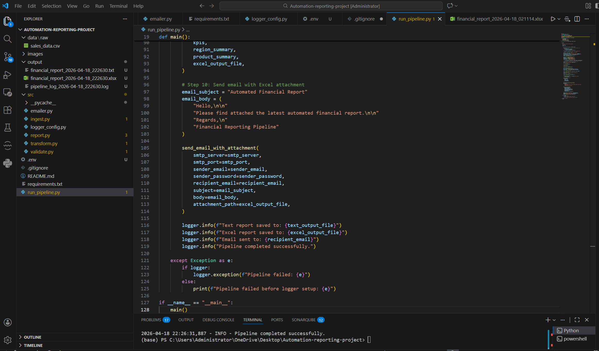

#📊 Automated Financial Reporting Pipeline

## 🚀 Overview

This project automates the end-to-end financial reporting workflow:

- Ingests raw CSV data
- Validates and transforms datasets
- Computes key financial KPIs
- Generates formatted Excel reports with charts
- Sends automated email reports with attachments
- Logs pipeline execution for traceability

Designed to simulate a real-world data engineering and reporting pipeline.

---

## 🧱 Project Structure

```
Automation-reporting-project/
│
├── data/
│   └── raw/
│       └── sales_data.csv
│
├── output/
│   ├── financial_report_*.txt
│   ├── financial_report_*.xlsx
│   └── pipeline_log_*.log
│
├── src/
│   ├── ingest.py
│   ├── validate.py
│   ├── transform.py
│   ├── report.py
│   ├── emailer.py
│   └── logger_config.py
│
├── .env
├── requirements.txt
├── run_pipeline.py
└── README.md
```

---

## ⚙️ Features

### ✅ Data Pipeline

* Data ingestion from CSV
* Data validation
* Data transformation
* KPI calculations

### 📈 Reporting

* Text-based financial report
* Excel report with:

  * Multiple sheets
  * Formatted tables
  * Auto-sized columns
  * Executive dashboard
  * Charts (Region & Product)

### 📧 Email Automation

* Sends Excel report as attachment
* Uses SMTP (Gmail supported)
* Secure via `.env` configuration

### ⏱️ Scheduling

* Automated execution via Windows Task Scheduler

### 📝 Logging

* Timestamped pipeline logs
* Tracks execution steps and outputs

---

## 🛠️ Installation

### 1. Clone or download project

```
git clone <your-repo-url>
cd Automation-reporting-project
```

### 2. Install dependencies

```
pip install -r requirements.txt
```

### 3. Setup environment variables

Create a `.env` file:

```
SMTP_SERVER=smtp.gmail.com
SMTP_PORT=587
SENDER_EMAIL=your_email@gmail.com
SENDER_PASSWORD=your_app_password
RECIPIENT_EMAIL=recipient_email@gmail.com
```

⚠️ Use a Gmail **App Password**, not your normal password.

---

## ▶️ Usage

Run the pipeline manually:

```
python run_pipeline.py data/raw/sales_data.csv
```

---

## 📦 Output

After execution, the pipeline generates:

* 📄 Text Report
* 📊 Excel Report with Dashboard
* 📧 Email with attachment
* 📝 Log file

---

## 📊 Dashboard Preview






---

## 🧠 Technologies Used

* Python
* Pandas
* OpenPyXL
* SMTP (Email automation)
* python-dotenv
* Windows Task Scheduler

---

## 🔄 Automation

The pipeline can be scheduled using Windows Task Scheduler to run:

* Daily
* Weekly
* On system startup

---

## 🧠 Skills Demonstrated

- Data Engineering (ETL pipeline design)
- Data Transformation with Pandas
- Excel Reporting Automation (OpenPyXL)
- Email Automation (SMTP)
- Environment Configuration (.env)
- Logging & Monitoring
- Automation & Scheduling

## 📌 Future Improvements

* Add database integration (SQL)
* Add web dashboard (Streamlit/Flask)
* Add advanced analytics
* Cloud deployment (AWS/Azure)

---

## 👨‍💻 Author

Darlington Ekeopara  
- GitHub: https://github.com/Git-Data123  
- Email: darlingtonekeopara@gmail.com

---

## ⭐ Notes

This project demonstrates:

* Data engineering workflow
* Automation
* Reporting
* Real-world business use case
